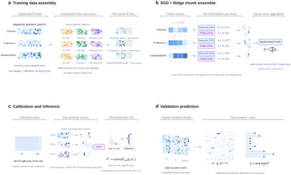

## neuropath-fml



Inference on new samples is possible end-to-end using docker at `/docker--submissions`. It contains the final solution submitted to BraTS-Path challenge.

For reproducing the training pipeline end-to-end, the original BraTS-Path data must first be downloaded and placed so that the following files are accessible:
```
DEFAULT_MAPPING_CSV = "data/BraTS-Path-2026-Train-Patch-Patient-Slide-Mapping.csv"
DEFAULT_TRAIN_GLOB = "data/train/shard-*.tar"
DEFAULT_VAL_GLOB = "data/val-shard-*.tar"
DEFAULT_ARTIFACTS = "artifacts"
```

The solution uses three pathology foundation models: Virchow2, H-optimus-1, and GenBio-PathFM. Embeddings for the BraTS-Path training and validation patches are generated by running:
``python extract_vhg_core.py``.

The final training uses additional Ivy GAP patches. The exact patch selection used for the submitted model is provided in reproducibility/ivy_selected_manifest.csv.gz.
To reconstruct the required Ivy patches:
``python ivy_selected_download_core.py``

After this step, the corresponding Ivy embeddings have to be generated for Virchow2, H-optimus-1, and GenBio-PathFM.

To obtain further augmentations used in the final solution `aug/extract_augmented_embeddings.py` and `aug/extract_local_stainaug_embeddings.py` have to be run.

The exact training code and inference on validation data is provided in an original form in `experimental-final__candidate/train-predict.py`.

